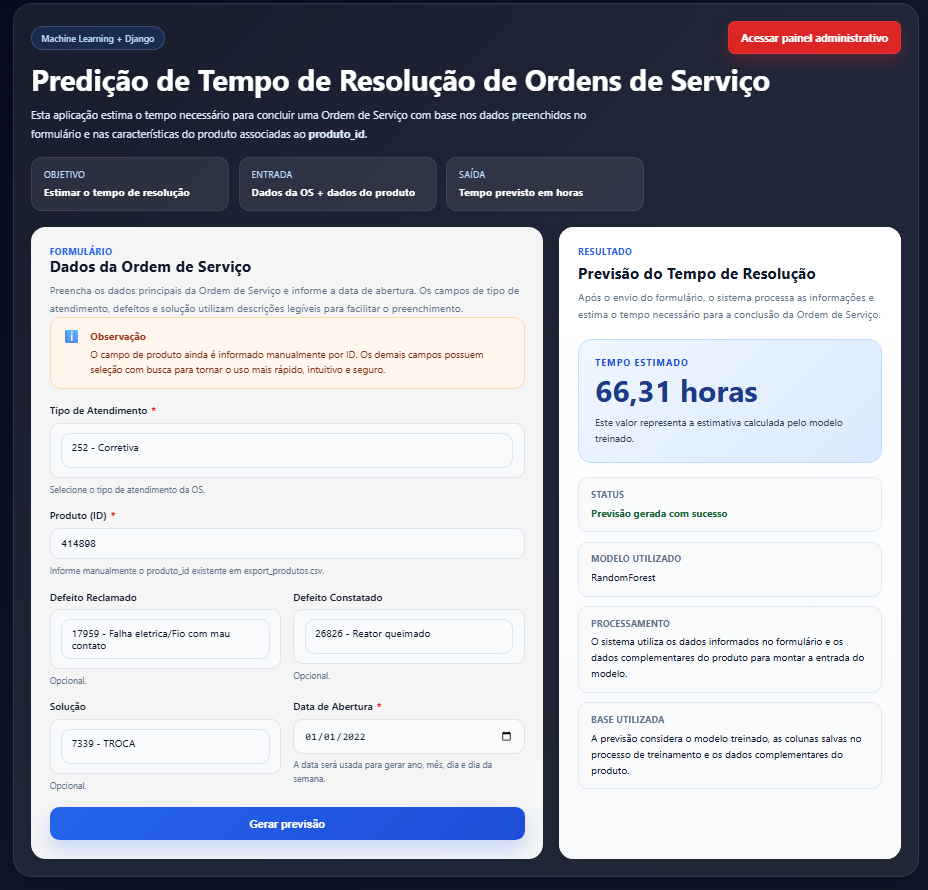

# 📊 PROPOSTA 6 — Predição de Tempo de Resolução - 3 IA

**Status:** Em desenvolvimento ⚠️👍

---


## 👥 Integrantes do Grupo

- Julia Soares de Azevedo Lombardi — RA: 2032874
- Kenji Yuri Mitsuka de Paula — RA: 2033472fvgb3e
- Lucia Maria Reis Braga — RA: 2035292
- Marcela Kawamoto Fernandes — RA: 2224453
- Matheus Bargas Rodrigues Flausino — RA: 2057008
- Nathan Gabriel da Silva — RA: 2078558
- Tainá De Souza Alves — RA: 2041631

---

## 🖼️ Demonstração do Sistema



---

# ▶️ Como Rodar o Projeto

Siga os passos abaixo para executar o sistema localmente.

---

## 1️⃣ Pré-requisito

É necessário ter o **Python instalado e configurado no PATH** do sistema.

Para verificar se está tudo certo, execute:

```bash
python --version
```

## 2️⃣ Clonar o Repositório

No terminal (CMD / PowerShell / Terminal):

```bash
git clone https://github.com/kawamotomarcela/Projeto-ia-telecom-6.git

cd Projeto-ia-telecom-6
```

## 3️⃣ Criar e Ativar o Ambiente Virtual

Windows (CMD)
```bash
python -m venv venv

venv\Scripts\activate
```

Linux / Mac
```bash
python3 -m venv venv

source venv/bin/activate
```
Caso use PowerShell e a ativação seja bloqueada

```bash
Set-ExecutionPolicy -Scope Process -ExecutionPolicy Bypass

venv\Scripts\activate
```

## 4️⃣ Instalar as Dependências

```bash
pip install -r requirements.txt
```
## 5️⃣ Baixar os Datasets

Agora o projeto utiliza um script para baixar automaticamente os arquivos necessários.

Execute:
```bash
python src/data/download_data.py
```

Esse script irá baixar os datasets a partir do link configurado no projeto e organizar os arquivos na pasta Dataset/.

Após o download, a estrutura esperada ficará assim:

```
Dataset/
├── export_os_defeito_solucao.csv
├── export_produtos.csv
├── DatasetInfo/
│   ├── export_tipos_atendimento.csv
│   ├── export_solucoes.csv
│   ├── export_defeitos_reclamados.csv
│   └── export_defeitos_constatados.csv
└── processed/
```

## 6️⃣ Gerar o Dataset Tratado

Depois de baixar os dados, execute o preprocessamento:

```bash
python src/data/preprocess.py
```
Esse script irá:

- carregar os datasets principais
- fazer o merge das bases
- criar features de data
- tratar valores ausentes
- gerar o dataset tratado

O arquivo gerado será:

```bash
Dataset/processed/dados_tratados.csv
```
## 7️⃣ Treinar o Modelo Oficial

Após gerar o dataset tratado, execute:
```bash
python src/train.py
```
Esse script irá:

- carregar o dataset tratado
- separar as variáveis de entrada e saída
- dividir os dados em treino e teste
- treinar o modelo oficial do projeto
- avaliar o modelo
- salvar os arquivos do modelo

Os arquivos gerados serão:
```
models/modelo_tempo_os.pkl
models/colunas_modelo.pkl
``` 

Esses arquivos são utilizados posteriormente pelo Django para gerar previsões.

## 8️⃣ Experimentos com Outros Modelos

Além do modelo oficial, o projeto também possui uma etapa de experimentos comparativos com diferentes abordagens de regressão.

Os modelos considerados são:

Random Forest
XGBoost
NN (Rede Neural com MLPRegressor)

Para executar os testes comparativos, utilize:
```bash
python src/train_experimentos.py
``` 
Esse script tem como objetivo:

- comparar diferentes modelos de regressão
- medir desempenho com as mesmas features
- registrar resultados para análise
- apoiar a escolha do melhor modelo para o projeto

Os resultados dos experimentos serão salvos em:
``` 
models/resultados_experimentos.json
``` 
Para verificar as informações dos arquivos `.pkl` e gerar um relatório em `.txt`, execute:

```bash
python ver_pkls.py
```

O relatório será salvo em:

```bash
resultado_pkls.txt
```

### Observação importante

- O uso de train_experimentos.py não substitui automaticamente o modelo principal do sistema.

- O modelo oficial do projeto continua sendo aquele salvo por train.py, pois ele representa a melhor versão escolhida para integração com a aplicação web.

- O arquivo `ver_pkls.py` serve apenas para inspeção e documentação dos arquivos gerados.

## 9️⃣ Configurar o Django

Execute as migrações do banco de dados:
```bash
python manage.py makemigrations
python manage.py migrate
```

## 🔟 Rodar o Servidor

```bash
python manage.py runserver
```
Abra no navegador:
```
http://127.0.0.1:8000
```

A interface permitirá inserir os dados da Ordem de Serviço e gerar a previsão de tempo de resolução.

# ✔️ Resumo Rápido

Windows (CMD)

```bash
python -m venv venv
venv\Scripts\activate
pip install -r requirements.txt
python src/data/download_data.py
python src/data/preprocess.py
python src/train.py
python src/train_experimentos.py
python ver_pkls.py
python manage.py makemigrations
python manage.py migrate
python manage.py runserver
```

Linux / Mac

```bash
python3 -m venv venv
source venv/bin/activate
pip install -r requirements.txt
python src/data/download_data.py
python src/data/preprocess.py
python src/train.py
python src/train_experimentos.py
python ver_pkls.py
python manage.py makemigrations
python manage.py migrate
python manage.py runserver
```
